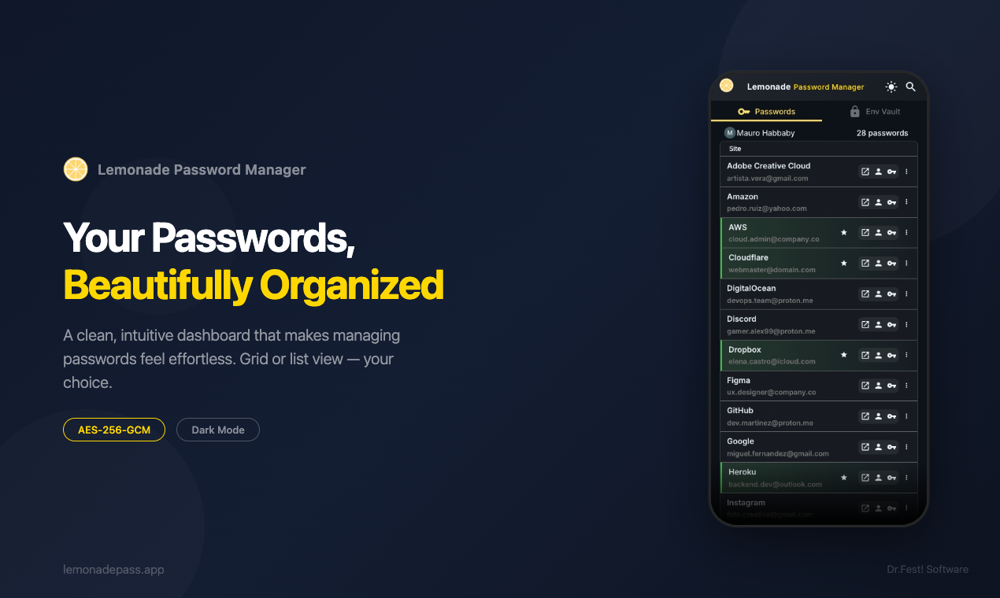

<p align="center">
  
</p>

<h1 align="center">Lemonade</h1>

<p align="center">
  <strong>Open-source password manager. Pay once, host anywhere.</strong>
</p>

<p align="center">
  <a href="https://lemonadepass.com">Hosted</a> ·
  <a href="dev-docs/SELF_HOSTING.md">Self-host</a> ·
  <a href="dev-docs/ARCHITECTURE.md">Architecture</a> ·
  <a href="SECURITY.md">Security</a> ·
  <a href="CONTRIBUTING.md">Contribute</a>
</p>

<p align="center">
  <a href="LICENSE"></a>
  
  
  
</p>

<p align="center">
  
</p>

## Why Lemonade

Lemonade is a password manager for people who don't want a subscription, don't want their secrets locked behind someone else's cloud, and don't want to read marketing pages to understand what they're getting.

The code is open. The crypto is auditable. You can run it on your own Firebase project for free, or pay once for a hosted account at [lemonadepass.com](https://lemonadepass.com) — same product, no feature gating.

## What's in it

- **Password vault** — AES-256-GCM server-side encryption, stored in Firestore. Multi-device sync.
- **Env Vault** — true client-side end-to-end encryption (PBKDF2-SHA256 600k + AES-256-GCM). The server stores ciphertext only.
- **Secure notes** — encrypted free-form notes.
- **TOTP / 2FA codes** — built-in authenticator.
- **Password sharing** — share entries within your instance.
- **Emergency access** — trusted contacts can request access after a configurable wait period.
- **Browser extensions** — Chrome MV3 and Firefox MV3, with autofill and domain validation.
- **WebAuthn / passkeys** — passwordless sign-in.
- **Password breach checks** — Have I Been Pwned integration (optional, bring your own key).
- **AI password insights** — Google Generative AI for strength analysis (optional, bring your own key).
- **Multi-language UI** — English, Spanish (es-AR), Portuguese (pt-BR), and more.

All of these features are available in both the hosted and self-hosted versions. There is no premium tier and no upsell flow.

## Get Lemonade

### Use the hosted version

Visit [**lemonadepass.com**](https://lemonadepass.com), sign in with Google, and start using it. A one-time payment of **US $29** unlocks a lifetime hosted account — sync across devices, the official extensions, and updates delivered automatically.

"Lifetime" means *while the project exists*. If Lemonade ever shuts down its hosted service, your data is fully exportable and the code is open: you can spin up the self-hosted version with zero lock-in.

### Self-host (free)

You bring a Firebase project, Lemonade runs on it. The Firebase free tier is enough to evaluate; for a single user, a self-hosted instance typically costs less than US $1/month.

```bash
git clone https://github.com/oktubr3/lemonade.git
cd lemonade
pnpm install
cd functions && npm install && cd ..

# Create a Firebase project at https://console.firebase.google.com
# Configure .env.local with your Firebase web config
# Configure Cloud Functions secrets (ENCRYPTION_KEY, etc.)

pnpm run build:manual
firebase deploy
```

The full walkthrough — enabling Auth providers, deploying Functions, configuring secrets, loading the extension — is in [`dev-docs/SELF_HOSTING.md`](dev-docs/SELF_HOSTING.md). The same guide is what we use to validate releases.

## Tech stack

- **Frontend**: Quasar Framework v2, Vue 3 (Composition API), Pinia, vue-i18n
- **Backend**: Firebase Cloud Functions (Node 22), Cloud Firestore, Firebase Auth, Firebase Secret Manager
- **Crypto**: AES-256-GCM (Node `crypto`) server-side for the main vault; PBKDF2-SHA256 (600k iterations) + HKDF + AES-256-GCM (Web Crypto API) client-side for the Env Vault
- **Extensions**: Chrome MV3 (Service Worker), Firefox MV3 (Background Scripts), shared OAuth handoff via the host browser identity API
- **PWA**: Workbox in InjectManifest mode, custom service worker with consent-based update notifications

A deeper architectural overview lives in [`dev-docs/ARCHITECTURE.md`](dev-docs/ARCHITECTURE.md).

## Security

The crypto, key handling, threat model, and known limitations are documented in [`SECURITY.md`](SECURITY.md). The short version:

- The **main vault is server-encrypted**, not zero-knowledge. A compromise of the Cloud Functions environment or Firebase Secret Manager would expose vault data. This is a documented trade-off in exchange for sharing, emergency access, and recoverability.
- The **Env Vault is true zero-knowledge**: the server cannot decrypt environment variables. Use it for the most sensitive material.
- Browser extensions persist refresh tokens in `storage.local`; a compromised browser profile can access them. There is no auto-lock today.
- See `SECURITY.md` for the full inventory.

To report a vulnerability: open a [private GitHub Security Advisory](https://github.com/oktubr3/lemonade/security/advisories/new). Do not file a public issue.

## Project status

Active development. Lemonade went open source in 2026 after operating as a closed-source product. The PWA, Firebase backend, and Chrome/Firefox extensions all live in this repository.

Current version: see [`package.json`](package.json). User-visible changes are recorded in [`CHANGELOG.md`](CHANGELOG.md).

## Contributing

Contributions are welcome — bug reports, documentation fixes, new features, security audits. See [`CONTRIBUTING.md`](CONTRIBUTING.md) for the development setup, branching, code style, and the Contributor License Agreement.

- **Ideas and questions** → [GitHub Discussions](https://github.com/oktubr3/lemonade/discussions)
- **Bugs and concrete feature requests** → [GitHub Issues](https://github.com/oktubr3/lemonade/issues)
- **Security vulnerabilities** → [private GitHub Security Advisory](https://github.com/oktubr3/lemonade/security/advisories/new)

## License

Released under the [GNU AGPL v3](LICENSE). If you modify Lemonade and run it as a service to others, your modifications must be published under the same license. The CLA you sign on your first contribution lets the project retain the option to relicense in the future if a specific commercial arrangement requires it — it is a defensive provision, not an intent to relicense.
